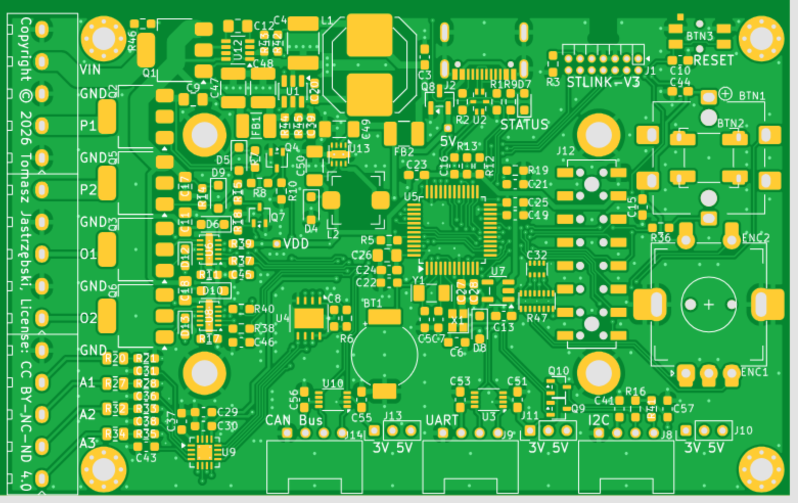

# All-Purpose Micro Controller (2nd Revision)

This repository contains the complete documentation for the second major revision of my [All-purpose Micro Controller](https://github.com/tdjastrzebski/All-Purpose-Power-Micro-Controller), originally released in 2021 and **favorably featured by [Hackaday](https://hackaday.com/2022/01/31/all-purpose-micro-controller/)**.

This revision incorporates numerous hardware and firmware improvements gained through extensive software and hardware development carried out over the past few years.

This revision has been completely redesigned and includes the following features:

- [STM32U575CI](https://www.st.com/en/microcontrollers-microprocessors/stm32u575ci.html) MCU with 2 MB Flash, 786 kB SRAM, running at up to 160 MHz
- Two programmable power outputs
- Two DAC-controlled precision constant-voltage or constant-current outputs (up to 9 V or 25 mA each) implemented with the [XTR200](https://www.ti.com/product/XTR200) 3-wire current/voltage transmitter
- Four analog inputs based on the Texas Instruments [ADS112S14](https://www.ti.com/product/ADS112S14) 4-/8-channel 16-bit ADC (pin-compatible 24-bit [ADS122S14](https://www.ti.com/product/ADS122S14) also supported)
- ST [M95P32](https://www.st.com/en/memories/m95p32-i.html) ultra-low-power 32-Mbit SPI EEPROM
- [STLINK-V3](https://www.st.com/en/development-tools/stlink-v3mini.html) Mini debugging connector
- Rotary encoder
- Popular [1.69" 240 × 280 LCD display](https://pl.aliexpress.com/item/1005009474858509.html)
- Battery-backed real-time clock (RTC)
- Three Seeed Studio Grove connectors (FDCAN, UART, and I²C), supporting both 3.3 V and 5 V peripherals
- USB-C connector for power and data
- Compact 85 × 52.5 mm PCB dimensions
- Wide 6–30 V input voltage range with reverse polarity protection

The hardware has been designed to be highly configurable. For example, it can be used as a controller for a **Weller WSP80** soldering iron powered from a standard 30 V / 5 A bench power supply.

I developed this platform both to evaluate new hardware and software design concepts and to provide a publicly available example of my current embedded hardware and firmware engineering skills.

**Language:** C/C++

**Development Environment:** STM32CubeIDE, STM32CubeMX, or Visual Studio Code. See [VS Code Environment Setup](Software/EnvironmentSetup.md).

## License

- The [Firmware](Firmware) is released under the MIT License.
- The [Hardware](Hardware) (KiCad design files) is released under the Attribution-NonCommercial-NoDerivatives 4.0 International (CC BY-NC-ND 4.0) License.

> **Note:** This project is still under active development. Documentation, firmware examples, and hardware updates will continue to be added. *(July 2026)*

